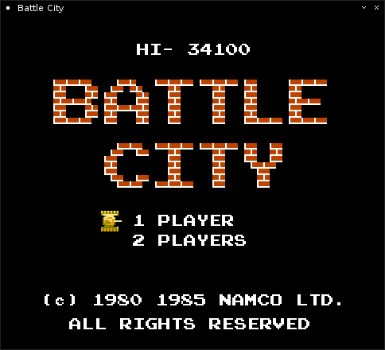

# battle-city-tank1990-pygame

Old famous NES game clone of Tank1990 (Battle City) by `PyGame`

> The classic beloved game which I used to play in the childhood



## Prerequisites

```yaml
python: 2.7 / 3.4+
pygame: 1.9.1+
```

## Differences from original NES version

There are some differences from original Battle City game:

- Ice terrain doesn't do anything. it acts like empty space. This is because I don't really know what supposed to happen. Hopefully this will be fixed.
- There are some missing sounds and I couldn't get that only one sound can be played simultaneously, pausing other and then resuming on finishing. So my BattleCity? has only basic sound support, which can be toggled during gameplay with "m".
- There is no "Stage X" screen before each stage.
- Power-ups are dropped randomly. I would even say too randomly, 'cause they are not always accessible (e.g. in the middle of water).
- If enemy is spawned during time-freeze, he also should be paused.
- Brick destruction is different: this game has static big block which is divided into 4 smaller static blocks. Original has smaller blocks whose destruction amount depends on which side bullet came from.

&copy; 1989 - 2025 @codeguru, All rights reserved.
